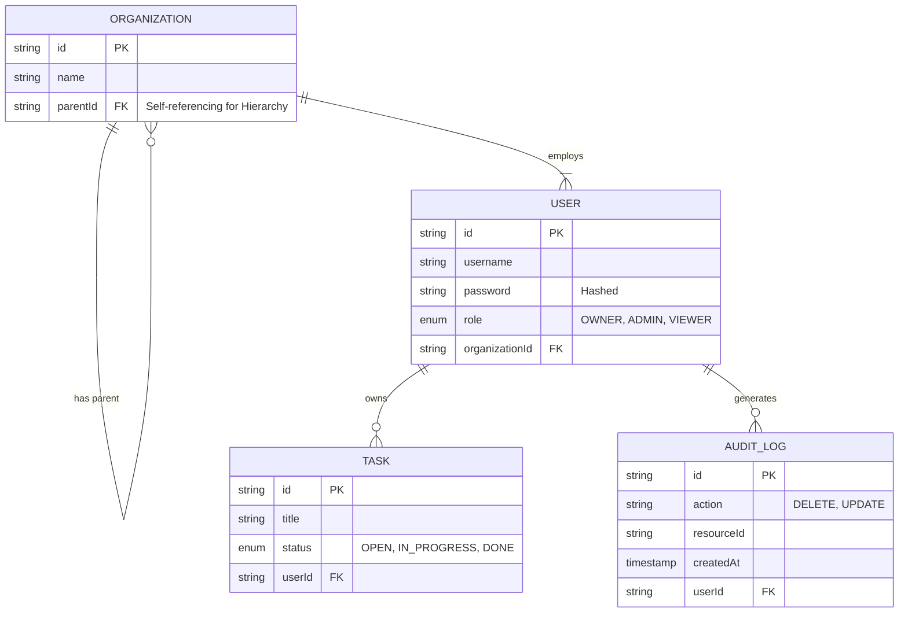

Secure Task Management System

## 🛠 Setup & Installation

### **1. Prerequisites**
Ensure you have the following installed on your machine:
* **Node.js** (v18 or higher)
* **NPM** or **Yarn**
* **Git**


### **2. Installation**

Clone the repository and install dependencies:
```bash
git clone <your-repo-url>
cd <repo-name>
npm install
```

### **3. Environment Configuration (.env)**
The application uses environment variables for database connection and JWT security.
Create a file named .env in the root directory of the project and populate it with the following:
### Security (JWT)
JWT_SECRET=super_secret_secure_key_123!
JWT_EXPIRATION=1h

### Database (SQLite)
DATABASE_NAME=database.sqlite
For the purpose of this assessment, the application includes fallback defaults for development ease. The database.sqlite file will be automatically created in the root directory upon the first launch.

### **4. Running the Application**
You can start both the Backend API and Frontend Dashboard simultaneously with a single command:
### npx nx run-many --target=serve --projects=api,dashboard
Once the servers are running:

### Frontend Dashboard: http://localhost:4200

### Backend API: http://localhost:3000/api

## Architecture Overview

This project is architected as an **Nx Monorepo**, ensuring strictly typed contracts between the Frontend and Backend while maximizing code reuse and modularity.

### **1. Monorepo Layout & Rationale**
The workspace is structured into **Applications** (deployable units) and **Libraries** (shared logic).

| Directory | Type | Stack | Responsibility |
| :--- | :--- | :--- | :--- |
| **`apps/api`** | Backend | NestJS + TypeORM | Secure REST API handling business logic, database transactions, and RBAC enforcement. |
| **`apps/dashboard`** | Frontend | Angular + Tailwind | Reactive Single Page Application (SPA) managing UI state and user interactions. |
| **`libs/`** | Shared | TypeScript | Reusable modules consumed by both apps to prevent code duplication. |

**Rationale for Monorepo:**
* **Type Safety across Boundaries:** By sharing interfaces, a change in the Backend data model instantly triggers compile-time errors in the Frontend, preventing runtime integration bugs.
* **Atomic Commits:** Features spanning both stack ends (e.g., "Add Task Priority") are committed together, simplifying version control.
* **DRY Principle:** Core logic is written once in `libs` and imported wherever needed.

---

### **2. Shared Libraries & Modules**
To meet the requirement for modularity, core logic was extracted into dedicated libraries:

#### **`libs/data` (The Contract)**
This library serves as the **Single Source of Truth** for the entire system.
* **Contents:** Shared TypeScript Interfaces (`ITask`, `IUser`), DTOs (`CreateTaskDto`), and Enums (`UserRole`, `TaskStatus`).
* **Usage:**
    * **Backend:** Entities implement these interfaces to ensure database schemas match the contract.
    * **Frontend:** Services use these types for strict HTTP response typing.

#### **🛡️ `libs/auth` (The Security Layer)**
This library contains reusable **Role-Based Access Control (RBAC)** logic.
* **Contents:**
    * `@Roles(...)` Decorator: A custom metadata stamp for protecting routes.
    * `RolesGuard`: The interceptor that verifies permissions against the JWT payload.
* **Usage:** Imported by the API to secure endpoints (e.g., `DELETE /tasks/:id`) without cluttering business logic.

## 🗄️ Data Model & Schema

The database schema is managed using **TypeORM** in a "Code-First" approach. We define high-level TypeScript entities, and the ORM automatically compiles them into SQL tables (`CREATE TABLE...`) with proper Foreign Key constraints.

### **1. Entity Relationship Diagram (ERD)**



### 2. Schema Description

#### Organization (Recursive Hierarchy)
* **Purpose:** Handles the "2-level hierarchy" requirement (Parent Corp vs. Departments).
* **Key Field:** `parentId` (Foreign Key).
* **Logic:** A **Self-Referencing Relationship**.
    * *Parent Organization:* `parentId` is NULL (e.g., "SpaceX").
    * *Sub-Organization:* `parentId` points to the Parent (e.g., "Engineering" points to "SpaceX").
    * *Why?* This allows for efficient recursive queries (e.g., "Find all departments under SpaceX") using a simple self-join, rather than creating a separate table for departments.

#### User
* **Purpose:** Identity management and Role-Based Access Control (RBAC).
* **Relationships:**
    * Belongs to one `Organization` (`organizationId` FK).
    * Has many `Tasks`.
* **Security:** Passwords are salted and hashed using `bcrypt` before storage.

#### Task
* **Purpose:** The core operational resource.
* **Key Design:** Uses a `userId` Foreign Key to enforce **Strict Ownership**.
* **Why strict ownership?** Instead of just linking tasks to an organization, linking them to a specific user allows for **Row-Level Security**.
    * *Viewer Query:* `SELECT * FROM task WHERE userId = :currentUserId` (Can only see their own rows).
    * *Admin Query:* `SELECT * FROM task WHERE organizationId = :orgId` (Can see all rows in the department).

#### Audit Log
* **Purpose:** Security, Accountability, and Compliance.
* **Why a separate table?** We separated `AuditLog` from `Task` for three reasons:
    1. **Immutability:** Operational data (Tasks) is mutable and can be overwritten. The Audit Log is append-only, preserving the history of *who* did *what* and *when*.
    2. **Forensics:** If a "fishy" actor deletes a task, the row is removed from the `Task` table. However, the `AuditLog` table retains the `DELETE` action, the `userId` of the perpetrator, and the timestamp.
    3. **Performance:** Decouples heavy historical data from the fast, real-time `Task` table.

### 3. Design Decisions

* **ORM (TypeORM):** Used to prevent SQL Injection and manage schema evolution. TypeScript classes (`@Entity`) are the single source of truth, converting strictly typed code into raw SQL `CREATE` statements at runtime.
* **Foreign Keys (Referential Integrity):**
    * `ON DELETE CASCADE` is used for Users and Tasks. If a User is deleted, their Tasks are automatically cleaned up by the database engine, preventing "orphan records."

    ## 🔐 Access Control & Security Strategy

The core of this application is a "Zero-Trust" security model. We assume that even authenticated users should only have access to the absolute minimum data required to do their job (**Least Privilege Principle**).

### **1. Role Hierarchy & Permissions**

The system enforces a strict 3-tier hierarchy based on the Organization structure.

* **OWNER (Global Scope)**
    * **Context:** The head of the main Organization (e.g., Elon at SpaceX).
    * **Permissions:** Can Create, Read, Update, and **Delete** any task in the entire hierarchy (including all sub-organizations). Can view all Audit Logs.

* **ADMIN (Department Scope)**
    * **Context:** The manager of a Sub-Organization (e.g., Head of Engineering).
    * **Permissions:** Can manage all tasks *within their specific department*. Can delete tasks to maintain board hygiene.

* **VIEWER (Personal Scope)**
    * **Context:** An individual contributor or external auditor.
    * **Permissions:** **Strictly Limited**. Can only View, Create, and Edit tasks assigned specifically to *them*.
    * **Restrictions:** Cannot Delete tasks. Cannot view Audit Logs. Cannot see tasks belonging to other colleagues in the same department.

### **2. The "Viewer Visibility" Decision (Design Rationale)**

One of the most critical architectural decisions was defining the scope of the **Viewer** role.
* *Option A:* Allow Viewers to see all tasks in their Sub-Organization (Collaborative Model).
* *Option B:* Restrict Viewers to only see their own tasks (Zero-Trust Model).

**We chose Option B (Strict Personal Scope).**

**The Rationale:**
In security engineering, it is safer to be "wrong and secure" than "wrong and insecure."
* If we are too strict (Option B), the worst-case scenario is a user complains they can't see a teammate's task. This is a simple **Feature Request** (ticket) to fix.
* If we are too permissive (Option A), the worst-case scenario is a Viewer (e.g., a contractor) seeing sensitive internal data they shouldn't. This is a **Data Breach**.

Therefore, the system defaults to maximum privacy. Viewers are siloed by default.

### **3. JWT Integration with Access Control**

We do not query the database to check permissions on every request. Instead, we use **Stateless Authentication** via JWTs.

1.  **Token Generation:** When a user logs in, the backend signs a JWT containing their `role`, `userId`, and `organizationId`.
2.  **The Guard (`RolesGuard`):** A custom NestJS Guard intercepts every request before it reaches the controller.
    * It extracts the JWT from the `Authorization` header.
    * It reads the `@Roles('ADMIN')` decorator on the route.
    * It compares the token's role against the required role.
3.  **The outcome:**
    * If a **Viewer** tries to `DELETE /tasks/:id`, the Guard sees they lack the `ADMIN` role and throws `403 Forbidden` instantly. The database is never even touched.

##  API Documentation

The API follows strict **RESTful** principles. All endpoints (except `/auth/login`) require a valid **Bearer Token** in the Authorization header.

### **1. Authentication**

#### **POST /auth/login**
Authenticates a user and returns a JWT.

**Request Body:**
```json
{
  "username": "elon",
  "password": "password123"
}
```

**Response (201 Created):**
```json
{
  "access_token": "eyJhbGciOiJIUzI1NiIsInR5cCI6IkpXVCJ9..."
}
```

---

### **2. Tasks Management**

#### **GET /tasks**
Retrieves a list of tasks.
* **Scope:**
    * **Admins/Owners:** Returns all tasks in the Organization/Department.
    * **Viewers:** Returns **only** tasks assigned to the current user.

**Response (200 OK):**
```json
[
  {
    "id": "task-uuid-1",
    "title": "Launch Starship",
    "description": "Prepare booster for static fire",
    "status": "IN_PROGRESS",
    "userId": "user-uuid-elon"
  },
  {
    "id": "task-uuid-2",
    "title": "Buy Twitter",
    "description": "Negotiate deal",
    "status": "DONE",
    "userId": "user-uuid-elon"
  }
]
```

#### **POST /tasks**
Creates a new task.

**Request Body:**
```json
{
  "title": "Refuel Booster",
  "description": "Load LOX and Methane",
  "status": "OPEN"
}
```

**Response (201 Created):**
```json
{
  "id": "task-uuid-3",
  "title": "Refuel Booster",
  "description": "Load LOX and Methane",
  "status": "OPEN",
  "userId": "user-uuid-current"
}
```

#### **DELETE /tasks/:id**
Deletes a task by ID.

* **Response (200 OK):** Task successfully deleted.
* **Response (403 Forbidden):** Returned if a **Viewer** attempts to delete a task (Strict RBAC enforcement).

---

### **3. Organization Hierarchy**

#### **GET /organizations/:id**
Retrieves organization details and its sub-departments.

**Response (200 OK):**
```json
{
  "id": "org-spacex",
  "name": "SpaceX",
  "children": [
    {
      "id": "dept-engineering",
      "name": "Engineering",
      "parentId": "org-spacex"
    },
    {
      "id": "dept-sales",
      "name": "Sales",
      "parentId": "org-spacex"
    }
  ]
}
```
## 🚀 Future Considerations & Scalability

While the current system implements a robust Zero-Trust architecture, a full-scale enterprise deployment would require the following enhancements to handle high concurrency and complex organizational structures.

### **1. Advanced Role Delegation**
* **Current State:** The system uses a static 3-tier hierarchy (Owner > Admin > Viewer).
* **Future State:** Implement **Granular Permission Sets** (e.g., `CAN_DELETE_TASKS`, `CAN_INVITE_USERS`). This would allow for custom roles like "Auditor" (Read-Only Global) or "Project Manager" (Write access to specific task tags, not just ownership).
* **Delegation:** Allow Admins to temporarily delegate permissions to a Viewer (e.g., "Acting Lead" during holidays) with an automatic expiration.

### **2. Production-Ready Security**
* **JWT Refresh Tokens:** Currently, the system relies on short-lived Access Tokens. For better UX/Security balance, we would implement **Refresh Token Rotation**. This allows us to keep Access Tokens very short (e.g., 5 mins) while detecting token theft via reuse detection.
* **CSRF Protection:** Although the API uses Bearer Tokens (which are generally safe from CSRF), enabling strict **CSRF tokens** and `SameSite` cookie policies would provide "Defense in Depth" if we introduce session-based features.
* **Rate Limiting:** Implement `ThrottlerModule` (Redis-backed) to prevent brute-force attacks on the `/login` endpoint or DoS attacks on the `/tasks` API.

### **3. Efficient Scaling of Permission Checks**
* **Extra Security:** Currently, role checks are fast because the role is embedded in the JWT. However, this has a "Revocation Gap" (a fired employee's token works until expiry).
    * *Solution:* Implement a **Redis-backed Revocation List**. The Guard would check Redis for the `jti` (Token ID) on every request. This adds ~2ms latency but ensures instant bans.
* **Policy Engines:** Hardcoding `RolesGuard` logic works for simple apps. for complex logic (e.g., "Can edit task ONLY if budget < $1000 AND created_at > 7 days"), we would migrate to **Casbin** to decouple policy logic from business code.


